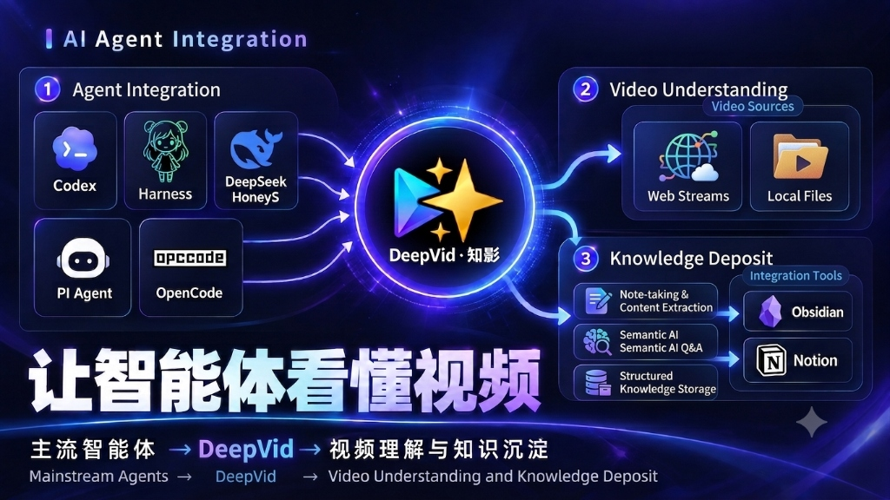

<div align="center">


# DeepVid · 知影

### 让 AI 拥有看懂视频的能力 · 原生连接 MCP 与 Obsidian
**兼容 Claude / Codex 等任意 AI Agent · 支持纯本地部署与 0 Token 消耗 · 图文专栏 · 思维导图 · 章节速读**

[下载客户端](https://github.com/977star/DeepVid/releases/latest) • [问题反馈](https://github.com/977star/DeepVid/issues)

<br/>

[](https://github.com/977star/DeepVid/releases)
[](LICENSE)
[](https://github.com/977star/DeepVid/releases)
[](https://github.com/977star/DeepVid)

<br/><br/>



</div>

---

## 为什么选择 DeepVid · 知影？

传统的 AI 视频总结往往只有寥寥几句概括，不仅丢掉了核心的操作板书与推导细节，而且看后即弃，无法真正被你的工具流复用。

DeepVid · 知影 让长视频从“信息孤岛”变成随时可被调用的**结构化数字资产**：

* **让 AI 真正看懂视频 (原生 MCP)**：通过 MCP 赋予 Claude、Codex 等任意 AI Agent 智能检索视频的能力。AI 可直接翻找视频音轨与关键帧提取答案，连原视频都不用你亲自翻找；
* **纯本地部署，0 Token 消耗**：支持完全离线运行，内置离线语音识别并支持直连 Ollama、LM Studio 等私有模型，断网也能全流程提炼，零 API 费用，100% 保护隐私；
* **图文笔记自动同步 Obsidian**：段落论点与实拍画面深度混排，自动打包高清配图与 Obsidian 高亮卡片，直接沉淀到你的第二大脑；
* **章节速读与智能大纲**：自动按内容精准拆解时间轴大纲与核心观点，2 分钟快速通览全片精要，感兴趣的章节一键直达；
* **全局一目了然的思维导图**：自动将长视频凝练为结构分明的树状思维导图，滚轮缩放、层级折叠展开，秒懂全片知识脉络；
* **多任务并行解析与手机扫码即看**：支持多视频并发后台提炼，追课复习不排队；电脑提炼完成，手机扫码即可躺平阅读。

---

## 核心功能

* **支持主流平台与本地文件**：
  * 支持粘贴 B站 (Bilibili)、YouTube、抖音、TikTok、小红书视频链接；
  * 支持直接拖拽本地 MP4、MOV 视频或 MP3、M4A 录音，秒级开始提炼。
* **模型与转写自由搭配**：
  * 支持直连云端主流模型（DeepSeek、Gemini、SiliconFlow）或任意 OpenAI 兼容接口；
  * 支持直连本地私有模型（Ollama、LM Studio），断网也能提炼；
  * 内置开箱即用的离线语音转写，无字幕视频也能一键转文字。
* **灵活的精读模式与思考深度**：
  * **连贯长文 vs 超长分段**：短视频一气呵成出专栏，超长讲座分段逐层剖析；
  * 支持开启深度思考（Reasoning）模式；
  * 毫秒级自适应抽帧，自动跳过片头黑屏，精准抓取演示画面。
* **无缝接入你的工作流**：
  * **MCP 智能检索**：作为外部 AI 助手的音视频知识库；
  * **Obsidian 归档**：导出含完整配图的独立文件夹；
  * **手机局域网阅读**：无需安装手机端 App，扫码即读。
* **本地存储与数据安全**：
  * 所有视频切片与精读成果 100% 保存在你的本地硬盘；
  * 内置一键缓存清理（安全保护加星收藏的笔记），随时为电脑腾出空间。

---

## 首次打开指南 (仅限测试版)

### macOS 提示「已损坏」或「无法打开」

打开系统 **「终端 (Terminal)」**，运行以下命令（需输入电脑密码）：

```bash
sudo xattr -rd com.apple.quarantine /Applications/DeepVid.app
```

<sub>*注：苹果 Gatekeeper 门禁对所有开源未签名应用的通用拦截，应用本身安全纯净。*</sub>

---

### Windows 提示「Windows 已保护你的电脑」

在弹出的窗口中点击 **「更多信息」** ➔ 点击 **「仍要运行」** 即可一秒进入。

<sub>*注：微软 SmartScreen 筛选器对新发布开源软件的通用保护提示。*</sub>

---

## 开源协议

本项目遵循 [MIT License](LICENSE) 开源协议。
